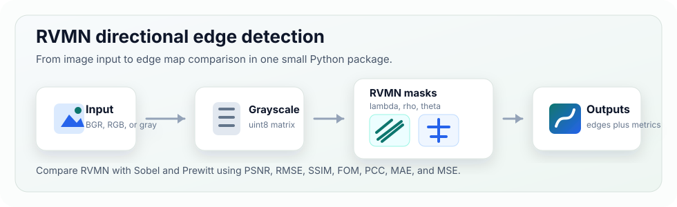
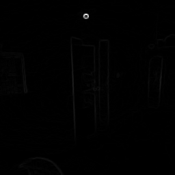
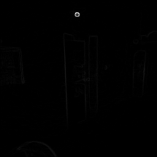
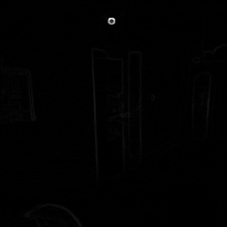

# rvmn

**RVMN** is a compact Python library for directional edge detection with
custom RVMN masks. It also includes Sobel and Prewitt baselines, parameter
search, image quality metrics, and a small command-line interface.



## Why RVMN?

RVMN builds edge maps by applying four directional masks controlled by
`lambda`, `rho`, and `theta`. The library is useful when you want to:

- experiment with RVMN-style edge filters,
- compare RVMN against Sobel and Prewitt,
- search parameter combinations automatically,
- report metrics such as PSNR, RMSE, SSIM, FOM, PCC, MAE, and MSE.

## Example Outputs

The images below show the same input processed with the package's comparison
helpers.

| RVMN | Sobel | Prewitt |
| --- | --- | --- |
|  |  |  |

## Installation

Install from PyPI:

```bash
pip install rvmn
```

Install locally for development:

```bash
pip install -e ".[dev,plots]"
```

## Quick Start

```python
import cv2
import rvmn

image = cv2.imread("image.png")
gray = rvmn.to_grayscale(image)

rvmn_edges = rvmn.apply_rvmn(gray, lam=0.1, rho=0.9, theta=0.3)
sobel_edges = rvmn.apply_sobel(gray)
prewitt_edges = rvmn.apply_prewitt(gray)

metrics = rvmn.compute_metrics(gray, rvmn_edges)
print(metrics.psnr, metrics.rmse)
```

## Parameter Search

Use `search_best_params` when you want the library to test multiple RVMN
parameter combinations and return the output with the highest PSNR.

```python
search = rvmn.search_best_params(
    gray,
    lambda_values=[0.1, 0.2, 0.3],
    rho_values=[0.7, 0.8, 0.9],
    theta_values=[0.1, 0.2, 0.3],
)

print(search.params)
print(search.metrics.psnr)
cv2.imwrite("rvmn_output.png", search.image)
```

## Compare Filters

`compare_edges` runs the best RVMN search plus Sobel and Prewitt in one call.

```python
comparison = rvmn.compare_edges(gray)

print("RVMN:", comparison.rvmn.params, comparison.rvmn.metrics.psnr)
print("Sobel:", comparison.sobel_metrics.psnr)
print("Prewitt:", comparison.prewitt_metrics.psnr)
```

## Command Line

Run a full comparison and save the output images:

```bash
rvmn image.png --output results
```

Use fixed RVMN parameters:

```bash
rvmn image.png --lambda 0.1 --rho 0.9 --theta 0.3 --output results
```

Print machine-readable metrics:

```bash
rvmn image.png --json
```

## API Overview

| Function | Purpose |
| --- | --- |
| `to_grayscale(image)` | Converts BGR, RGB, or grayscale input into a grayscale `uint8` image. |
| `generate_rvmn_masks(lam, rho, theta)` | Builds the four directional RVMN masks. |
| `apply_rvmn(gray, lam, rho, theta)` | Applies RVMN masks and returns a normalized edge image. |
| `apply_sobel(gray)` | Applies Sobel edge detection. |
| `apply_prewitt(gray)` | Applies Prewitt edge detection. |
| `compute_metrics(reference, processed)` | Computes MSE, RMSE, PSNR, SSIM, FOM, PCC, and MAE. |
| `search_best_params(gray, ...)` | Finds the best RVMN result from a parameter grid. |
| `compare_edges(gray, ...)` | Compares RVMN, Sobel, and Prewitt outputs. |

## Development

Run the test suite:

```bash
pytest
```

Build package artifacts:

```bash
python -m build
```

## Project Structure

```text
rvmn_library/
  src/rvmn/          library code
  tests/             pytest tests
  results/           example edge outputs
  docs/assets/       README visuals
  pyproject.toml     package metadata
```
